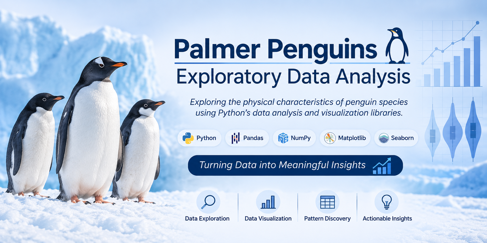
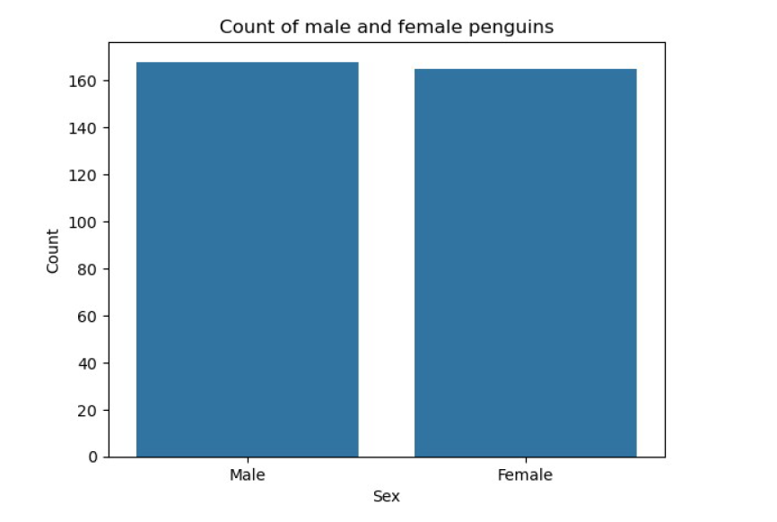
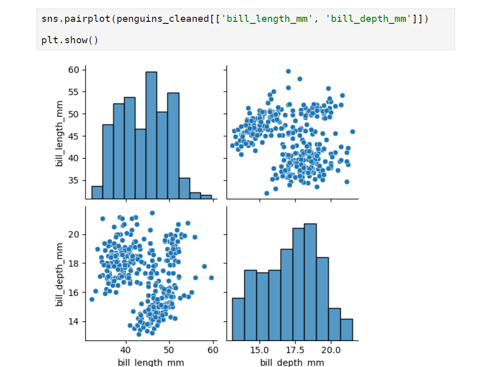
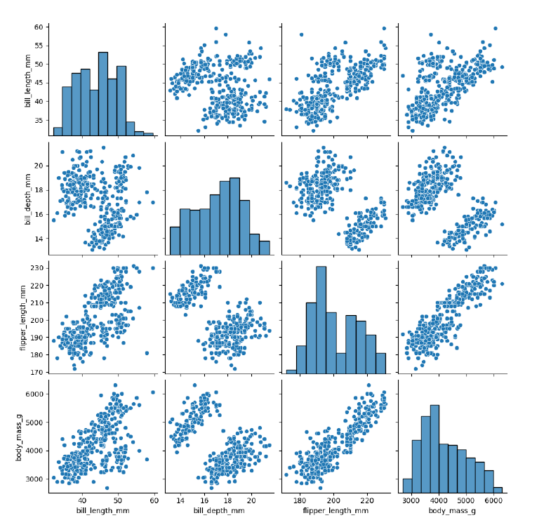
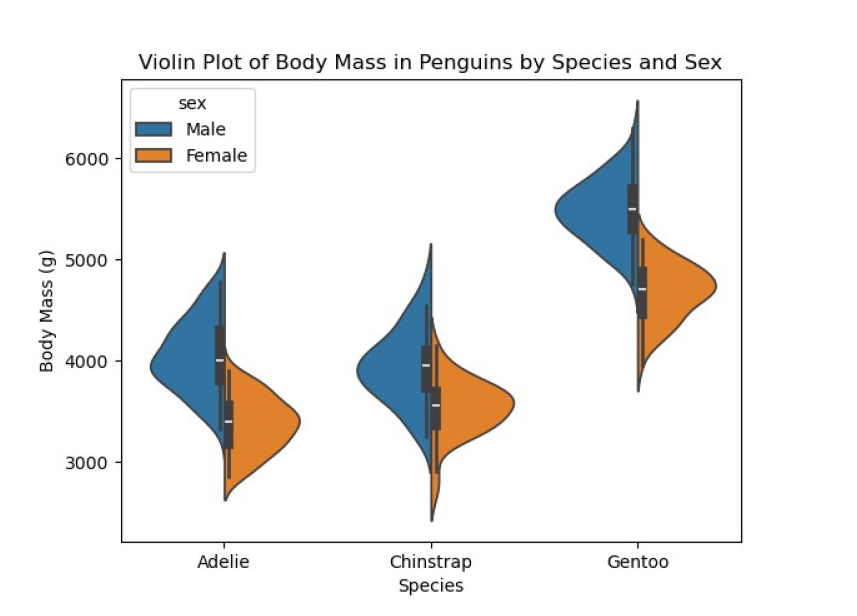

<p align="center">
  
</p>

# 🐧 Palmer Penguins Exploratory Data Analysis (EDA)

<p align="center">
  <strong>Exploratory Data Analysis of the Palmer Penguins dataset using Python, Pandas, Matplotlib, and Seaborn.</strong>
</p>

<p align="center">


</p>

---

# 📌 Project Overview

This project is a **Basic Data Science Capstone Project** focused on performing **Exploratory Data Analysis (EDA)** using the Palmer Penguins dataset.

The objective was to clean the data, explore relationships between variables, identify patterns, detect outliers, and communicate meaningful insights through statistical summaries and visualizations.

---

# 🎯 Objectives

- Explore the Palmer Penguins dataset
- Perform data cleaning
- Handle missing values
- Analyze numerical and categorical variables
- Visualize distributions and relationships
- Detect outliers
- Draw meaningful business and statistical insights

---

# 📊 Dataset

The Palmer Penguins dataset contains measurements collected from penguins living on islands in Antarctica.

### Features include:

- Species
- Island
- Bill Length
- Bill Depth
- Flipper Length
- Body Mass
- Sex

---

# 🛠 Technologies Used

- Python
- Pandas
- NumPy
- Matplotlib
- Seaborn
- Jupyter Notebook

---

# 📈 Exploratory Data Analysis

The analysis includes:

- Dataset Overview
- Data Types
- Missing Value Analysis
- Descriptive Statistics
- Distribution Analysis
- Relationship Analysis
- Outlier Detection

---

# 📊 Visualizations

# 📊 Count Plot



**Interpretation:**  
The count plot shows the distribution of penguin species in the dataset. Adelie penguins have the highest number of observations.

---

# 📈 Pair Plot



**Interpretation:**  
The pair plot reveals relationships between numerical variables. Penguins with longer flippers generally tend to have higher body mass, indicating a positive relationship between flipper length and body mass.

---

# 📦 Box Plot



**Interpretation:**  
The box plot highlights the distribution of body mass and identifies potential outliers. Gentoo penguins generally have a higher body mass than the other species.

---

# 🎻 Violin Plot



**Interpretation:**  
The violin plot combines a box plot with a density plot, showing the distribution and spread of body mass for each penguin species.

---

# 💡 Key Insights

- Gentoo penguins generally have the highest body mass.
- Male penguins tend to weigh more than females.
- Flipper length has a positive relationship with body mass.
- Missing values were identified and handled before analysis.
- Box plots highlighted potential outliers.
- Pair plots revealed relationships between numerical features.

---

# 📂 Project Structure

```text
palmer-penguins-eda/
│
├── Palmer_Penguins_EDA.ipynb
└── README.md
```

---

# ▶️ How to Run

Clone the repository

```bash
git clone https://github.com/Blissfulebby/palmer-penguins-eda.git
```

Navigate into the folder

```bash
cd palmer-penguins-eda
```

Launch Jupyter Notebook

```bash
jupyter notebook
```

Open

```text
Palmer_Penguins_EDA.ipynb
```

---

# 📚 Skills Demonstrated

- Exploratory Data Analysis (EDA)
- Data Cleaning
- Data Visualization
- Statistical Analysis
- Python Programming
- Data Interpretation

---

# 🚀 Future Improvements

- Interactive dashboards
- Correlation heatmaps
- Feature engineering
- Predictive machine learning models

---

# 👩🏽‍💻 Author

**Agatha Onwudiwe**

- 💼 LinkedIn: https://www.linkedin.com/in/agatha-onwudiwe-86b87215b
- 🌐 Portfolio: https://blissfulebby.github.io/AggiePortfolio
- 📧 Email: agatha.onwudiwe@gmail.com

---

⭐ If you found this project helpful, consider giving it a **Star**!
